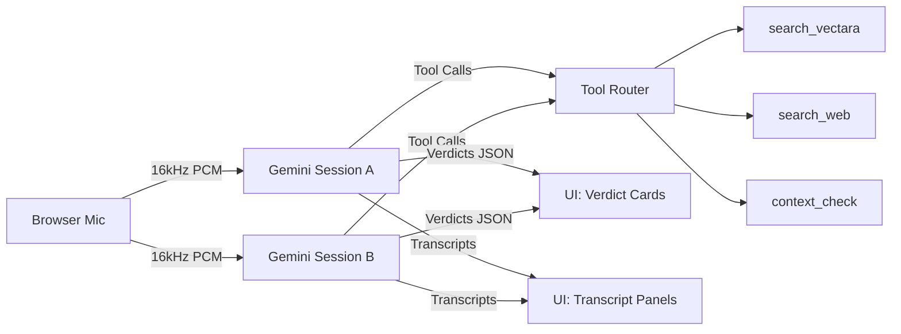

# Truthy - Real-Time Debate Fact Checker

AI-powered fact-checking for live debates using **Google Gemini Realtime API**.

## Overview

Truthy listens to two speakers in a debate, transcribes their speech in real-time, detects factual claims, verifies them against trusted sources, and displays concise verdicts with citations — all in under 5 seconds.

Built for the **Gemini + Fetch.ai Hackathon** to strengthen healthy democracies by grounding public discourse in shared, verifiable truth.

## Features

- **Real-Time Transcription**: Two simultaneous Gemini Live sessions (Speaker A & B)
- **Claim Detection**: AI identifies check-worthy factual statements
- **Multi-Source Verification**: Searches Vectara corpus, web sources, and context validation
- **Live Verdict Display**: Color-coded badges (True → Unverifiable) with confidence scores
- **OBS Overlay**: `/overlay` route for livestream lower-third display
- **TypeScript + Tailwind**: Strong typing and modern UI

## Tech Stack

| Component | Technology |
|-----------|-----------|
| Frontend | Next.js 15 + React 19 + TypeScript |
| Styling | Tailwind CSS |
| AI Model | Google Gemini 2.0 Flash (Realtime) |
| Audio | Web Audio API (16kHz input, 24kHz output) |
| Database | PostgreSQL + Prisma (optional) |
| Tools | Zod validation |

## Quick Start

### Prerequisites

- **Node.js 18+** and npm/pnpm
- **Gemini API Key**: Get one at [Google AI Studio](https://aistudio.google.com/apikey)

### Installation

1. **Clone and install dependencies**
   ```bash
   cd truthy
   npm install
   ```

2. **Configure environment**
   ```bash
   cp .env.example .env
   ```
   Edit `.env` and add your `NEXT_PUBLIC_GEMINI_API_KEY`.

   ⚠️ **WARNING**: For hackathon demo only! Never expose API keys in production browsers. Use a server-side proxy instead.

3. **Run the development server**
   ```bash
   npm run dev
   ```

4. **Open the app**
   - Main UI: [http://localhost:3000/debate](http://localhost:3000/debate)
   - OBS Overlay: [http://localhost:3000/overlay](http://localhost:3000/overlay)

## Usage

### Demo Steps

1. Click **"Start Recording"** to begin
2. Use the **Speaker A / B toggle** to switch which speaker's audio is being captured
3. Speak factual claims (try: "Violent crime in Chicago dropped 17% this year")
4. Watch transcripts appear in the left panels
5. See verdict cards populate on the right with:
   - Color-coded labels (True, Mostly True, Mixed, etc.)
   - Confidence percentage
   - Rationale + sources with "as of" dates

### OBS Setup (for livestreams)

1. In OBS, add a **Browser Source**
2. URL: `http://localhost:3000/overlay`
3. Width: 1920, Height: 200
4. Enable "Shutdown source when not visible"
5. The latest verdict will appear as a lower-third overlay

## Project Structure

```
truthy/
├── app/
│   ├── api/tools/              # Mock tool endpoints (vectara, web, context_check)
│   ├── components/             # UI components (VerdictCard, TranscriptPanel, etc.)
│   ├── hooks/                  # useDebateCore (main logic)
│   ├── debate/page.tsx         # Main debate UI
│   ├── overlay/page.tsx        # OBS lower-third
│   └── layout.tsx              # Root layout
├── lib/
│   ├── audio.ts                # PCM encoding/decoding
│   ├── analyser.ts             # Audio level visualization
│   └── db.ts                   # Prisma client (optional)
├── prisma/schema.prisma        # Database schema
├── types/index.ts              # TypeScript definitions
├── docs/                       # PRD, TDS, API specs, prompts
└── reference/                  # Gemini Live example code
```

## Architecture



**Key Flow**:
1. User toggles Speaker A/B
2. Mic audio → Active Gemini session
3. Gemini detects claim → calls tools
4. Tools return evidence (mock data for MVP)
5. Gemini synthesizes verdict JSON
6. UI parses and displays verdict card

## Configuration

### Environment Variables

See `.env.example` for all options. Key variables:

- `NEXT_PUBLIC_GEMINI_API_KEY` - **Required** for Gemini Realtime
- `VECTARA_API_KEY` - Optional, for future integration
- `DATABASE_URL` - Optional, for persistence

### Gemini Model

Currently using `gemini-2.0-flash-exp` for low-latency realtime processing. See `app/hooks/useDebateCore.ts` to change models.

### Tool Endpoints

Mock implementations in `/app/api/tools/`:
- `search_vectara` - Returns Chicago PD crime data
- `search_web` - Returns FBI UCR data
- `context_check` - Validates metric/timeframe consistency

**TODO**: Replace with real Vectara, Fetch.ai agents, and web scraping.

## Database (Optional)

Prisma schema is included but **not required for MVP**. To enable:

1. Set `DATABASE_URL` in `.env`
2. Run `npm run db:push` to create tables
3. Implement persistence in `lib/persistence.ts` (currently TODO)

## Deployment

### Vercel (Recommended)

1. Push to GitHub
2. Import to Vercel
3. Add `NEXT_PUBLIC_GEMINI_API_KEY` in Environment Variables
4. Deploy

⚠️ **Production Note**: Move API key to server-side route handler, not client-side env var.

### Docker (Alternative)

```bash
# Build
docker build -t truthy .

# Run
docker run -p 3000:3000 -e NEXT_PUBLIC_GEMINI_API_KEY=your_key truthy
```

## Development

```bash
# Install dependencies
npm install

# Run dev server
npm run dev

# Type check
npm run build

# Lint
npm run lint

# Database (if using Prisma)
npm run db:push
npm run db:studio
```

## Known Limitations (MVP)

- **Single mic input**: Manual toggle for Speaker A/B (no dual-mic support yet)
- **Mock tool data**: Tools return hardcoded evidence
- **No persistence**: Verdicts/transcripts stored in-memory only
- **Client-side API key**: Insecure for production (demo only!)
- **No LiveKit**: Direct Gemini connection (simpler but less scalable)

## Roadmap

See `docs/TODO.md` for post-hackathon enhancements:
- Real Vectara integration
- Fetch.ai agent orchestration
- Multi-speaker diarization
- WebSocket persistence
- API/SDK for third-party integrations

## License

MIT License - see LICENSE file

## Contributing

1. Fork the repo
2. Create a feature branch
3. Submit a PR with clear description

## Acknowledgments

- **Google Gemini Team** for Realtime API
- **Fetch.ai** for agent framework inspiration
- **Vectara** for trusted corpus infrastructure
- Reference code adapted from Google's Gemini Live examples

## Support

- Issues: [GitHub Issues](https://github.com/yourusername/truthy/issues)
- Docs: `docs/` folder (PRD, TDS, API.md, PROMPTS.md)
- Demo video: [Link TBD]

---

**Built with ⚖️ for informed democracies**
