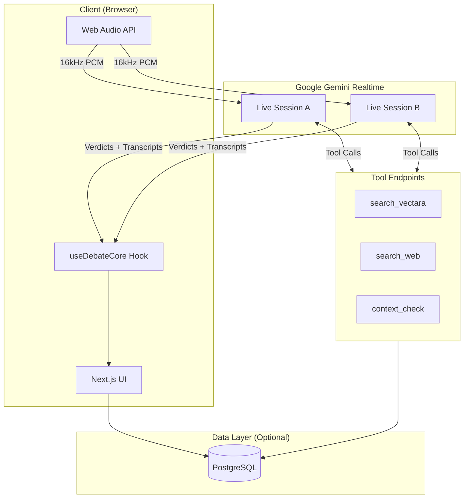
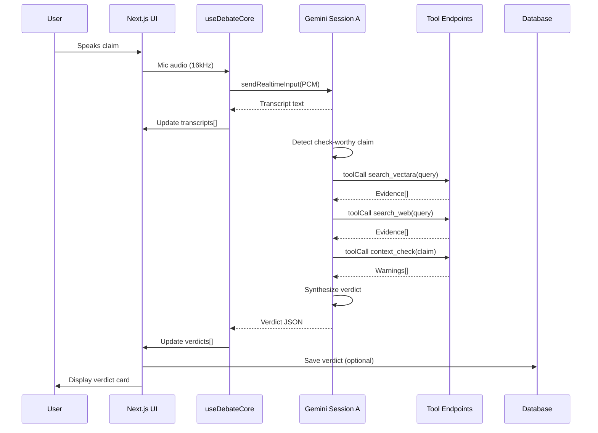

# Truthstream Architecture

## System Overview

Truthstream is a real-time fact-checking system that listens to live debate audio, transcribes speech, detects factual claims, verifies them against trusted sources, and displays verdicts in under 5 seconds.

## High-Level Architecture



## Components

### 1. Frontend (Next.js + React)

**Location**: `/app`

**Key Files**:
- `/app/hooks/useDebateCore.ts` - Core logic managing two Gemini sessions
- `/app/debate/page.tsx` - Main UI with transcript panels and verdict feed
- `/app/overlay/page.tsx` - OBS-friendly lower-third display
- `/app/components/*` - Reusable UI components

**Responsibilities**:
- Capture microphone audio via `getUserMedia`
- Convert to 16kHz mono PCM
- Route audio to active Gemini session (A or B)
- Parse incoming messages:
  - Text → Verdict JSON or Transcript
  - Tool calls → POST to API routes
  - Audio → Playback via Web Audio
- Render transcripts and verdict cards

**State Management**:
- Single `useDebateCore` hook returns `{ state, actions }`
- State: `transcripts[]`, `verdicts[]`, `isConnectedA/B`, `activeSpeaker`, etc.
- Actions: `startRecording()`, `stopRecording()`, `setActiveSpeaker()`

### 2. Gemini Realtime API

**Model**: `gemini-2.0-flash-exp`

**Sessions**: Two independent WebSocket connections (Speaker A, Speaker B)

**Configuration**:
```typescript
{
  model: 'gemini-2.0-flash-exp',
  responseModalities: [Modality.AUDIO, Modality.TEXT],
  systemInstruction: SYSTEM_INSTRUCTION,
  tools: [search_vectara, search_web, context_check],
  speechConfig: { voiceConfig: { voiceName: 'Puck' } }
}
```

**System Instruction**: See `/docs/prompts.md`
- Transcribe audio
- Detect check-worthy claims
- Call tools with precise queries
- Return verdict JSON only (no prose)

**Input**: PCM audio blobs (`audio/pcm;rate=16000`)

**Output**:
- `serverContent.modelTurn.parts[].text` → Verdict JSON or Transcript
- `serverContent.modelTurn.parts[].inlineData` → Audio (24kHz PCM)
- `toolCall.functionCalls[]` → Tool invocations

### 3. Tool Router & Endpoints

**Location**: `/app/api/tools/`

**Endpoints**:
1. **POST `/api/tools/search_vectara`**
   - Input: `{ query, top_k, freshness_days, filters }`
   - Output: `{ items: Evidence[] }`
   - Mock: Returns Chicago PD crime data

2. **POST `/api/tools/search_web`**
   - Input: `{ query, top_k, recency_days, allowlist }`
   - Output: `{ items: Evidence[] }`
   - Mock: Returns FBI UCR data

3. **POST `/api/tools/context_check`**
   - Input: `{ claim, expected }`
   - Output: `{ ok, warnings[], notes }`
   - Mock: Simple pattern matching for metric mismatches

**Request Flow**:
1. Gemini emits `toolCall.functionCalls`
2. `useDebateCore` loops over calls
3. Fetches corresponding `/api/tools/{name}`
4. Sends response via `session.sendToolResponse()`

### 4. Data Layer (PostgreSQL + Prisma)

**Status**: Optional in MVP

**Schema**: See `/prisma/schema.prisma`

**Tables**:
- `sessions` - Debate sessions
- `transcripts` - Per-speaker speech segments
- `claims` - Detected factual claims
- `evidence` - Retrieved source snippets
- `verdicts` - Final fact-check results

**Usage**:
- Currently stubbed in `/lib/db.ts`
- Can save verdicts/transcripts for post-debate analysis
- Full-text search on claims with PostgreSQL `tsvector`

## Data Flow

### Claim Detection → Verdict Flow



## Audio Pipeline

### Input (Mic → Gemini)

1. `navigator.mediaDevices.getUserMedia({ audio: true })`
2. `AudioContext({ sampleRate: 16000 })`
3. `ScriptProcessorNode` captures `Float32Array`
4. Convert to `Int16` PCM via `createBlob()`
5. Base64 encode → `{ data, mimeType: 'audio/pcm;rate=16000' }`
6. `session.sendRealtimeInput({ media: blob })`

### Output (Gemini → Speaker)

1. Receive `inlineData.data` (base64 Int16 PCM at 24kHz)
2. Decode to `Uint8Array` → `AudioBuffer`
3. Create `AudioBufferSourceNode`
4. Connect to `outputNode` → `AudioContext.destination`
5. Schedule playback with `nextStartTime` for seamless queueing

## Speaker Management

**Challenge**: Single mic input, two speakers

**Solution**: Manual toggle with `activeSpeaker` state

- UI shows **Speaker A / Speaker B** toggle buttons
- Active speaker's session receives all mic audio
- Audio level meter tracks only the active speaker
- Transcripts tagged with `speaker: 'A' | 'B'`

**Future**: Integrate LiveKit for true multi-track audio or use speaker diarization models.

## Verdict JSON Schema

```json
{
  "speaker": "A",
  "claim": "Violent crime in Chicago dropped 17% this year.",
  "label": "Mostly True",
  "confidence": 0.74,
  "rationale": "Local dashboard shows ~16.7% YTD decrease vs prior year.",
  "sources": [
    {
      "name": "Chicago PD Dashboard",
      "url": "https://data.cityofchicago.org/...",
      "as_of": "2025-09-30"
    }
  ]
}
```

**Parsing**:
- `useDebateCore` attempts `JSON.parse(part.text)`
- If successful and has `claim`, `label`, `confidence` → `Verdict`
- Else → `Transcript`

## Deployment Options

### Option 1: Vercel + Edge Functions

- Deploy Next.js to Vercel
- Tool endpoints run as serverless functions
- Gemini sessions connect directly from browser
- ⚠️ API key exposed client-side (demo only!)

### Option 2: Self-Hosted (Docker)

- Single container with Next.js + API routes
- Optional: Separate Postgres container
- Nginx reverse proxy for `/api` routes
- Can add server-side WebSocket proxy for Gemini

### Option 3: Full Microservices (Future)

- Next.js frontend (Vercel)
- FastAPI tool router (Oracle Cloud)
- Fetch.ai agents (serverless)
- LiveKit media server
- PostgreSQL (Supabase)
- Vectara (SaaS)

## Security Considerations

**Current (MVP)**:
- API key in `NEXT_PUBLIC_GEMINI_API_KEY` → visible in browser
- No authentication
- CORS open

**Production TODO**:
- Server-side Gemini proxy (hide API key)
- JWT-based auth for tool endpoints
- Rate limiting (60 req/min per session)
- Input sanitization (Zod schemas ✓)
- HTTPS only
- Allowlist domains for web search

## Performance

**Target**: < 5 seconds from speech → displayed verdict

**Breakdown**:
- Transcription: ~500ms (Gemini Realtime)
- Claim detection: ~200ms
- Tool calls: 300-400ms each (3 parallel)
- Verdict synthesis: ~500ms
- **Total**: ~2-3 seconds typical

**Bottlenecks**:
- Network latency to Gemini API
- Tool endpoint response times
- Large audio buffers (mitigated with 256-sample chunks)

**Optimizations**:
- Parallel tool invocations
- Prompt engineering to reduce token generation
- Edge deployment closer to Gemini servers

## Future Enhancements

See `/docs/TODO.md` for full roadmap:
- Real Vectara integration
- Fetch.ai agent orchestration
- LiveKit multi-speaker rooms
- Speaker diarization
- Moderator console (approve/suppress verdicts)
- Real-time WebSocket for overlay updates
- Multilingual support

## References

- [Google Gemini Realtime Docs](https://ai.google.dev/gemini-api/docs/live)
- [Web Audio API](https://developer.mozilla.org/en-US/docs/Web/API/Web_Audio_API)
- [Prisma](https://www.prisma.io/)
- [Tailwind CSS](https://tailwindcss.com/)
